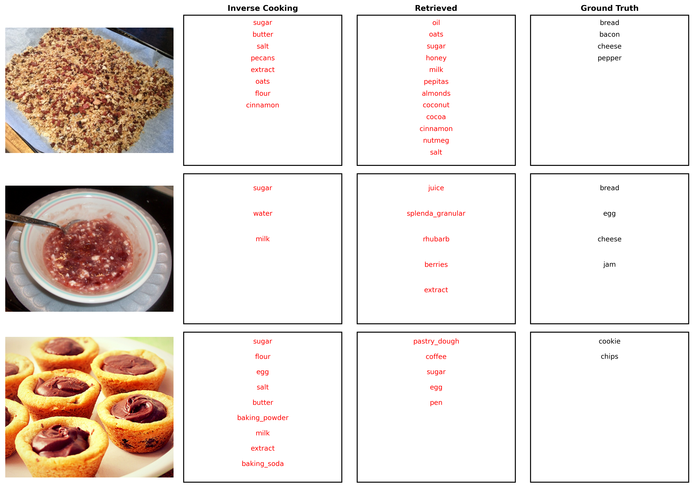

## Steps to run
Step 1: Run python script file to add image id to combined JSON file. Take a look at ```AddImageIdToCombinedJSON.py```

Step 2: Run python script file to add image path to combined JSON file. Take a look at ```AddImagePathToCombinedJSON.py```

Step 3: Run python script file to visualize ingredients list comparison between retrieval, generative approach vs. ground truth

